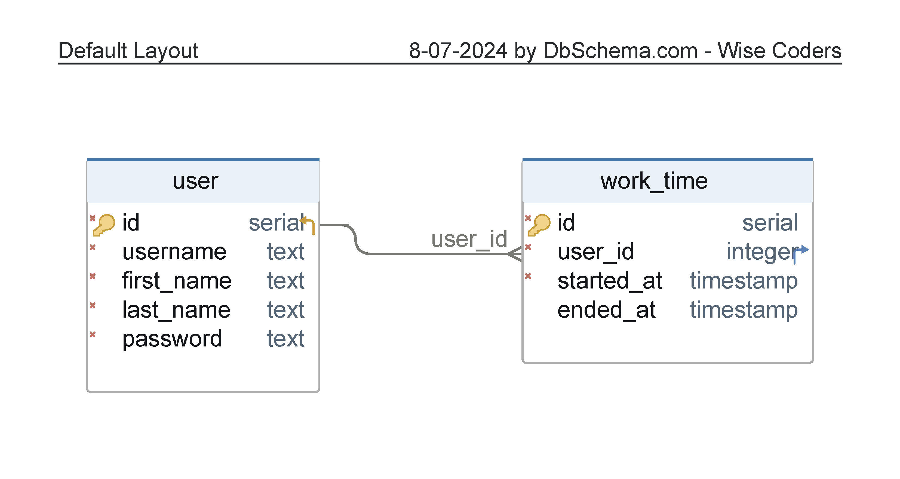

# TimesWD

Lösung der Schnupperaufgabe in TypeScript mit [Bun](https://bun.sh/) + [Vite](https://vitejs.dev/) + React. Bun wird hier als schnellere Alternative zu NodeJS benutzt. (Man kann auch Node mit diesem Code benutzen, die Skripte müssten dann nur angepasst werden)

### Backend

Im Backend wird eine PostgreSQL-Datenbank per [Drizzle-ORM](https://orm.drizzle.team/) angesteuert. Dort gibt es 2 Tabellen: User und WorkTime. Für den User werden grundlegende Eigenschaften plus Nutzername und Passwort für den Login gespeichert. Das Passwort ist hier als mit bcrypt (SaltRounds=10) gehasht vorgegeben angesehen.

Das Backend bietet eine REST-API, die mithilfe von [ElysiaJS](https://elysiajs.com/) implementiert wurde. Diese besteht aus wenigen "GET" und "POST" Befehlen.

Der Mailversand funktioniert über das Package Nodemailer.

### Frontend

Das Frontend wurde mit Vite und React aufgebaut - und Bootstrap für UI-Elemente.

Zum Laden der Daten aus dem Backend werden eine Mischung aus Elysia (Treaty) und [Tanstack/React Query](https://tanstack.com/query/latest) benutzt.

Der Login ist simpel gelöst: falls die Daten übereinstimmen, wird einfach auf die nächste Seite weitergeleitet. Beim Starten wird die Startzeit in die Datenbank geschrieben und auch im Localstorage des Browsers gespeichert, damit beim Neuladen der Seite die angefangene Arbeitszeit nicht verloren geht. Nach dem Stoppen wird die Endzeit auch in die DB eingetragen und der Localstorage bereinigt. Das Backend schickt dann auch die Mail ab, wenn die Daten in die Datenbank eingespeichert wurden.

Die Übericht gibt alle Arbeitszeiten für den ausgewählten Tag als einfache Liste aus, falls welche vorhanden sind.

# Benutzung

Als Voraussetzung dient Bun, wie oben beschrieben. Die Kommandos sind im Grunde dieselben wie von Node.
Das Projekt ist in die Ordner frontend und backend aufgeteilt, die je ihre eigenen Pakete haben. Diese muss man jeweils in jedem Ordner mit "bun install" installieren. Im Root-Ordner kann man das auch machen und dann mit "bun dev" das Frontend und Backend direkt gleichzeitig starten (mithilfe des Pakets [concurrently](https://www.npmjs.com/package/concurrently)).

Doch bevor dies funktioniert, müssen die .env.example Dateien in .env umbenannt und deren Inhalte angepasst werden. Hier sind die Einstellungen von Datenbank, Serveradresse und -port sowie des Mailversands zu finden.

### Datenbank initialisieren

Wenn man den Connection String für die Datenbank hat, kann man im backend-Ordner mit "bun db:generate" und "bun db:migrate" die Tabellen erstellen lassen. Mit "bun db:test" lässt sich ein Testnutzer einfügen mit dem Nutzernamen "test" und dem Passwort "qwer".
